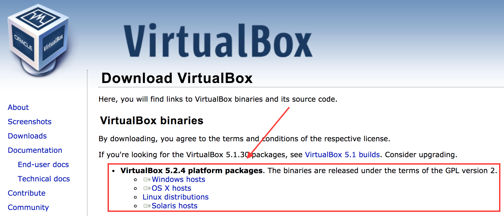
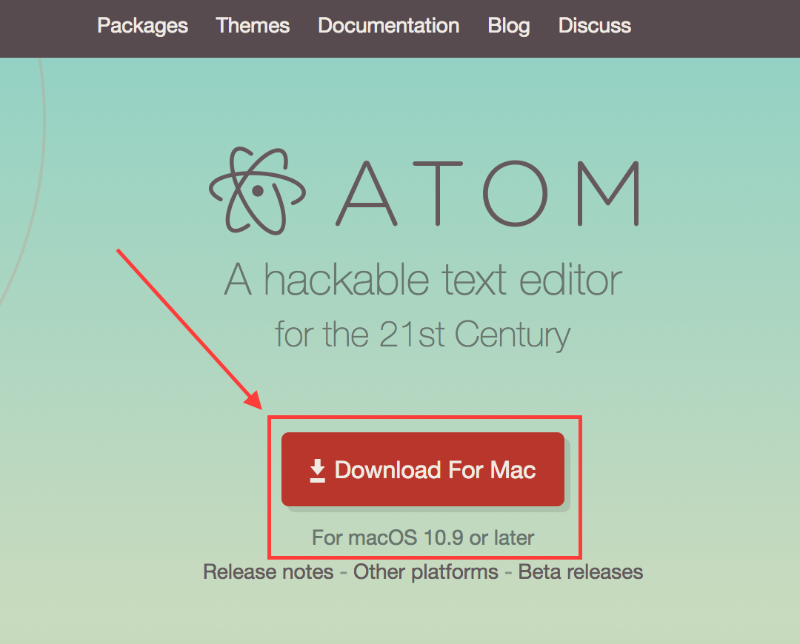

# Getting Started
There are going to be a _lot_ of topics covered in the next few pages, so please _read them carefully_.

## Virtualization: What is it?
This is often one of the most difficult things for people to grasp initially, but becomes easier as people become more comfortable with the concept and engage with it in a meaningful way.

[Virtualization|https://en.wikipedia.org/wiki/Virtualization] as stated by Wikipedia:

> Hardware virtualization or platform virtualization refers to the creation of a virtual machine that acts like a real computer with an operating system. Software executed on these virtual machines is separated from the underlying hardware resources. For example, a computer that is running Microsoft Windows may host a virtual machine that looks like a computer with the Ubuntu Linux operating system; Ubuntu-based software can be run on the virtual machine.

There are several reasons why this is potentially useful:

* You want to run software that does not run on your current operating system (Windows on a Mac, Ubuntu on Windows, iOS on Ubuntu, Windows on Windows, etc.)
* You want to try a different version of the same OS you are currently running (Windows 2008 Server on Windows 10, et. al.)
* You want to develop, test, or debug specific software without making large-scale changes to your "base" (or "host" machine in virtualization parlance)
* You want to have a local "lab" or "sandbox" that you can do stuff in without breaking anything

## How do I make sure that I can operate Virtual Machines (VMs)?
Typically you will need to:

* Ensure that your computer's BIOS has any available "virtualization" options enabled (Google is your friend here)
* Install software that will allow you to create, manage, and delete VMs
* Understand the fundamentals of what a VM can and cannot do for you

## What do I do to get started?
Once you have any available "Virtualization" options in your computer's BIOS enabled, you should be able to install the requisite software to begin creating and managing virtual machines.

### Oracle VM VirtualBox
Being able to create, modify, and delete Virtual Machines (hereafter referred to as "VMs") is the bare minimum required to take advantage of this documentation.  From the VirtualBox main page:

> VirtualBox is a general-purpose full virtualizer for x86 hardware, targeted at server, desktop and embedded use.

To begin:

* Go to the [Downloads page|https://www.virtualbox.org/wiki/Downloads]
* Click on the link that relates to the Operating System that you are running: 
* Once the download has completed, open the installer and follow the instructions to install the software (and reboot as required)

### Atom (Text Editor)
A text editor that can grow with you in functionality as you progress and develop your skills is necessary.  To this end, I recommend [Atom.io|https://atom.io].  From the Wikipedia page about Atom.io:

> Atom is a free and open-source text and source code editor for macOS, Linux, and Microsoft Windows with support for plug-ins written in Node.js, and embedded Git Control, developed by GitHub. Atom is a desktop application built using web technologies. Most of the extending packages have free software licenses and are community-built and maintained. Atom is based on Electron (formerly known as Atom Shell), a framework that enables cross-platform desktop applications using Chromium and Node.js. It is written in CoffeeScript and Less. It can also be used as an integrated development environment (IDE). Atom was released from beta, as version 1.0, on 25 June 2015. Its developers call it a "hackable text editor for the 21st Century".

Atom is an extremely powerful text-editor and is very useful for highlighting the syntax of various types of text files such as:

* Configuration files
* Source code
* HTML
* and much more

* Go to [Atom.io|https://atom.io/]
* Click the red "Download For" link: 
* Once the download has completed, open the installer and follow the instructions to install the software (and reboot as required)

On the next page we will begin to cover a more advanced topic: version control.

# Recommended Reading
- [Wikipedia - Virtualization|https://en.wikipedia.org/wiki/Virtualization]
- [VirtualBox Docs - "Why is virtualization useful?"|https://www.virtualbox.org/manual/ch01.html#idm26]
