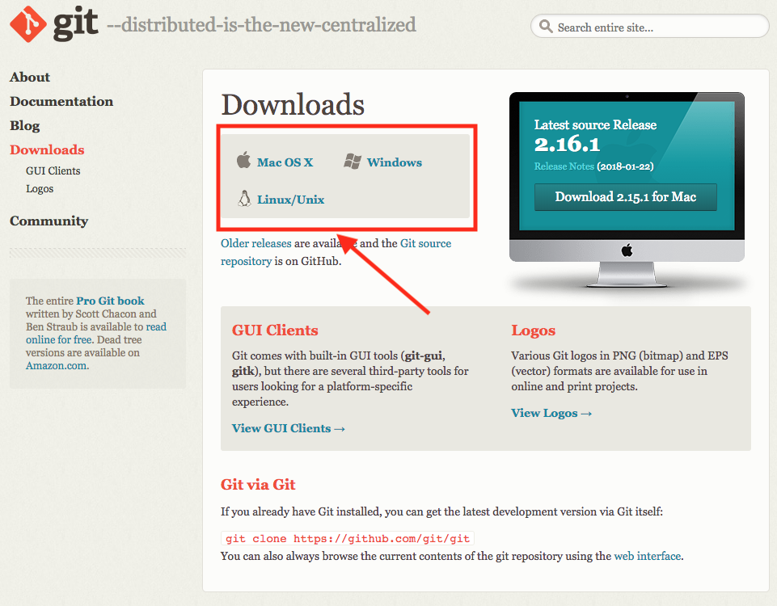

# Version Control
[Version control](https://en.wikipedia.org/wiki/Version_control) (as described by Wikipedia):

> In computer software engineering, revision control is any kind of practice that tracks and provides control over changes to source code. Software developers sometimes use revision control software to maintain documentation and configuration files as well as source code.

> As teams design, develop and deploy software, it is common for multiple versions of the same software to be deployed in different sites and for the software's developers to be working simultaneously on updates. Bugs or features of the software are often only present in certain versions (because of the fixing of some problems and the introduction of others as the program develops). Therefore, for the purposes of locating and fixing bugs, it is vitally important to be able to retrieve and run different versions of the software to determine in which version(s) the problem occurs. It may also be necessary to develop two versions of the software concurrently: for instance, where one version has bugs fixed, but no new features (branch), while the other version is where new features are worked on (trunk).

In short, version control is a methodology (and associated tools) to help record changes to files and provide methods to commit, revert, and otherwise manage files.  As an example, this documentation repository (often shortened to "repo") is one such example of a set of files under version control.  The "history" of the repo can be viewed using commands contained within the `git` tool, among many other actions.

# Git
>"Git" is a version control system for tracking changes in computer files and coordinating work on those files among multiple people. It is primarily used for source code management in software development, but it can be used to keep track of changes in any set of files. As a distributed revision control system it is aimed at speed, data integrity, and support for distributed, non-linear workflows.

For the purposes of the exercises in this repo, we're only going to focus on the  commands in `git` that will enable us to use tools and libraries available from the internet.

# Install git
To install `git` on your local machine:

* Go to the 
* Click the "Downloads" link: 
* Once the download has completed, open the installer and follow the instructions to install the software (and reboot as required)

# Example git commands
* `git clone` - Creates a copy of a repository on your local machine that you have the rights to access (public GitHub repos are an example of this)
* `git checkout` - Allows a user to change "branches" within a given repository
* `git pull` - Pulls down the latest changes from the `origin` of a repo (often this is GitHub)
* `git status` - Gives the current status of the repo
* `git add` - Adds files to be committed
* `git remove` (or `rm`) - Removes files prior to a commit
* `git commit` - Creates a new commit with the changed files list
* `git push` - Pushes the changes in the changed files list to the `origin`

# Next
Getting started with a Virtual Machine in **VirtualBox**.

# Recommended Reading
- [Git Basics Video Tutorials (git-scm.com)](https://git-scm.com/videos)
- [Git Basics Written Tutorial (git-scm.com)](https://git-scm.com/docs/gittutorial)
- [Git Tutorial For Beginners: Command-Line Fundamentals (youtube.com)](https://www.youtube.com/watch?v=HVsySz-h9r4)
