# VirtualBox
If you've followed the instructions in the previous steps, you should now have a basic, virtualization-capable environment to begin learning about running Linux systems.  Let's begin!

**Note**: Your particular version of VirtualBox may look different depending on what your Operating System (OS) is.  Examples are from a host running Mac OSX.

## Creating a virtual machine (VM)
1. Launch the VirtualBox application
1. Click "New" in the top left: 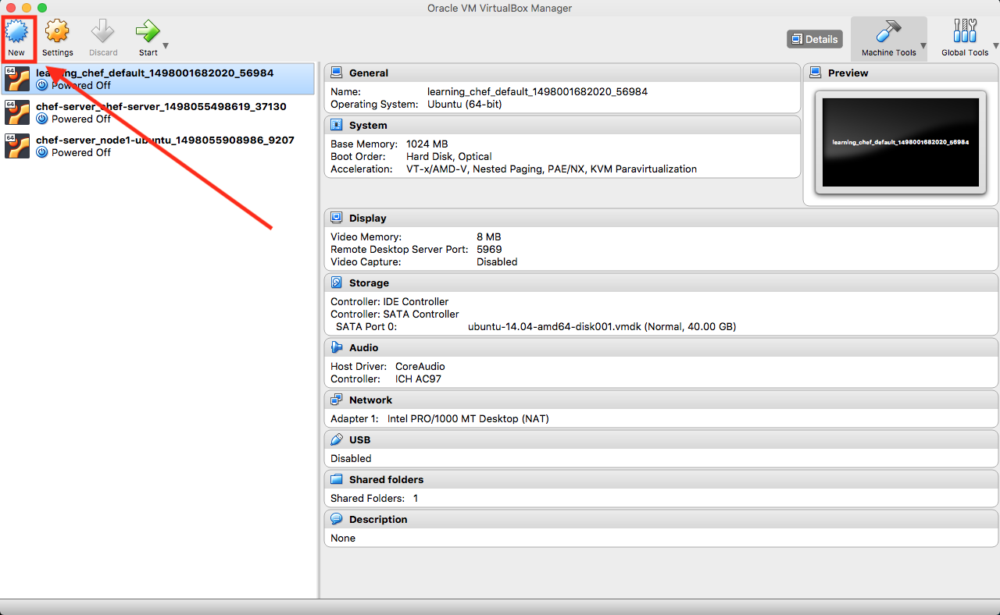
1. Type "Ubuntu 16.04" into the "Name" field: 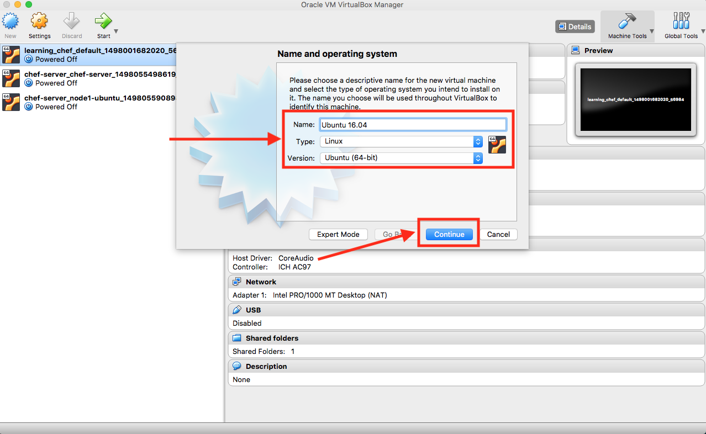
1. Use the default memory value that VirtualBox provides 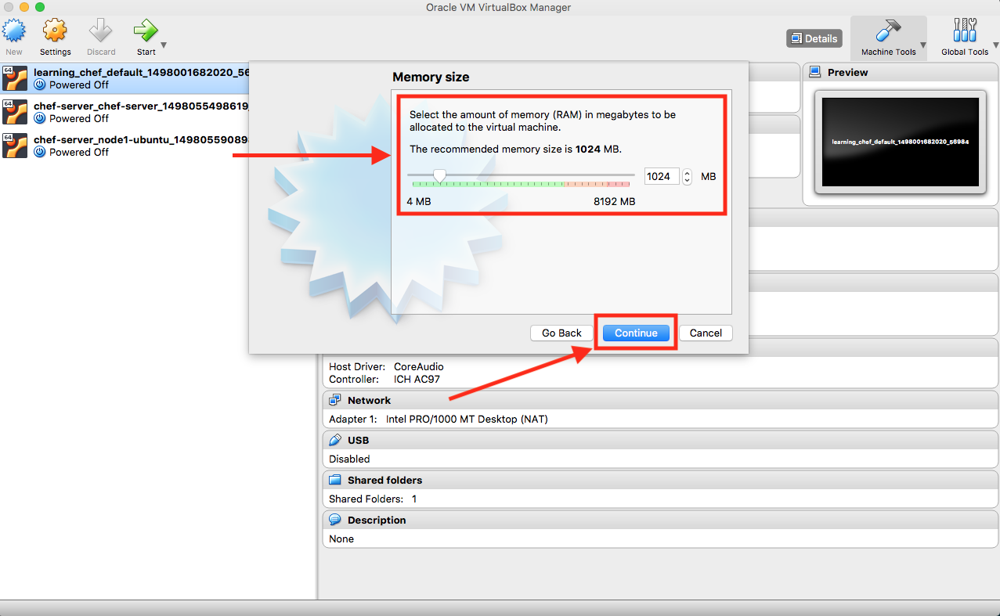
1. Use the default virtual hard disk selection and click "Create": 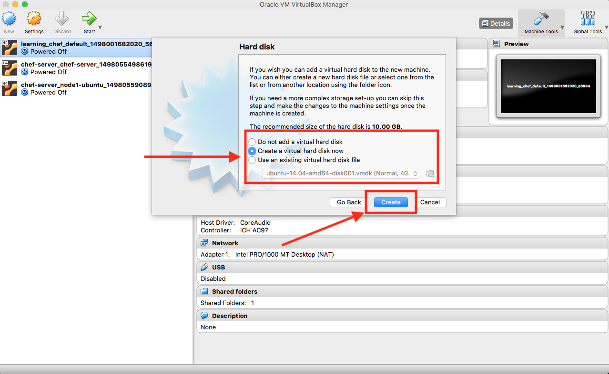
1. For any further context menus that are presented, leave their values alone and click "Continue" or "Create" as appropriate.
1. Once this process completes, you should have a virtual machine called "Ubuntu 16.04" on the left: 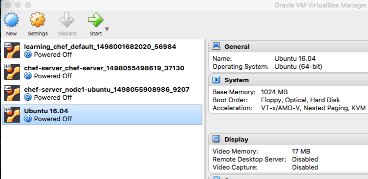

## Download the Ubuntu 16.04 disk image
* [Ubuntu 16.04 Disk Image](https://www.ubuntu.com/download/desktop/thank-you?version=16.04.3&architecture=amd64)

Remember where you saved this file.  You'll be using it in the next step to install Ubuntu 16.04 onto your newly-created VM.

## Installing Ubuntu
1. Right-click on the new VM and click "Settings": 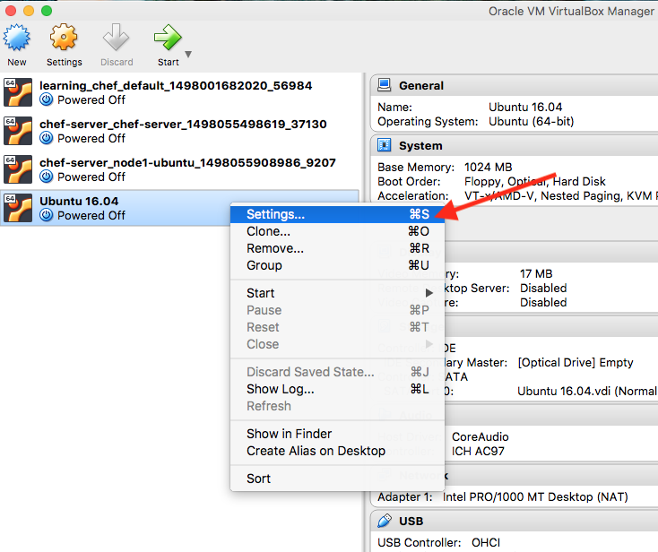
1. Click the "Storage" button (1), then click the CD device under "IDE" (2), then click the CD image on the far right of the window (3): 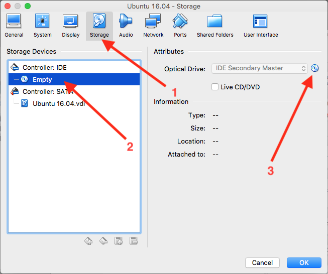
1. Click "Choose Virtual Optical Disk File...", find the Ubuntu disk image you downloaded, select it, then click "OK":
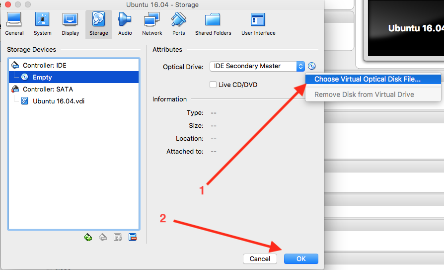
1. Click the "Start" icon (not the down-arrow on the same button): 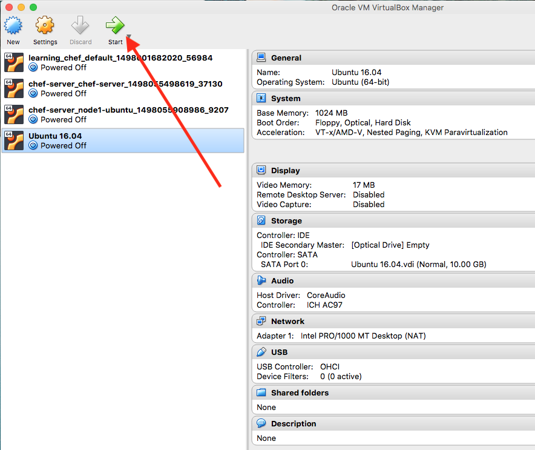
1. Click the checkbox for "Do not show this message again" and click "Capture". This is a prompt informing you that VirtualBox will automatically capture your keyboard and mouse input when the VM's window is made active. 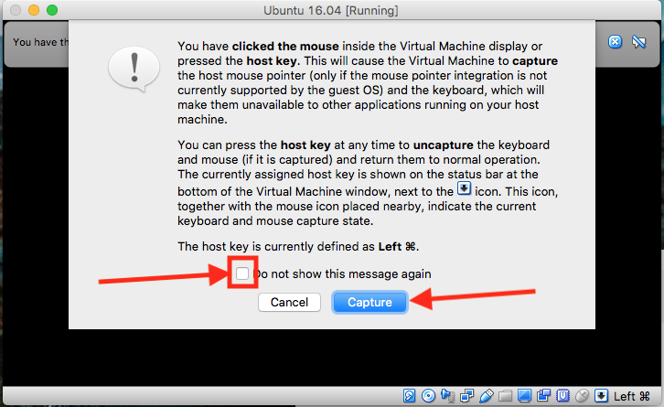
1. Follow the prompts to install Ubuntu.  Default settings are acceptable for this installation.  If you require assistance installing Ubuntu on this VM, please refer to the [Ubuntu Installation Tutorial](https://tutorials.ubuntu.com/tutorial/tutorial-install-ubuntu-desktop#4). 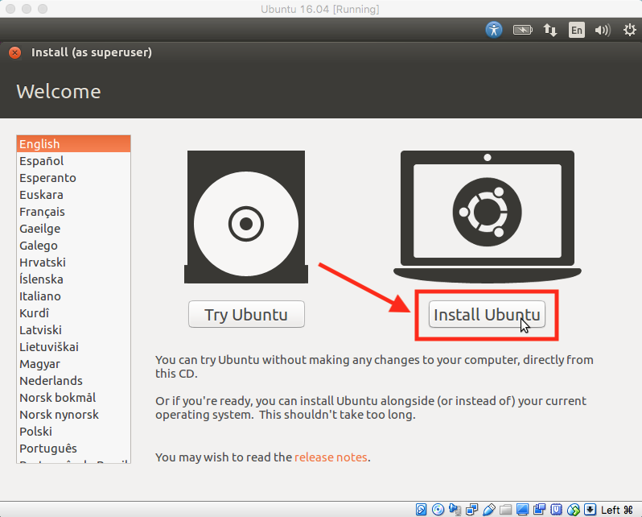
1. Once the installation has completed, you should be presented with a working Ubuntu installation: 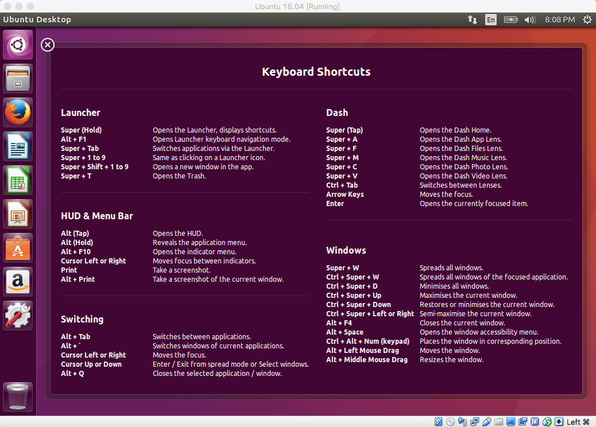
